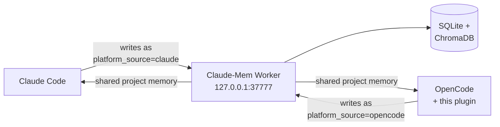
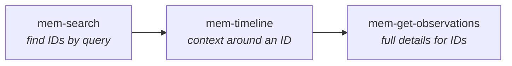
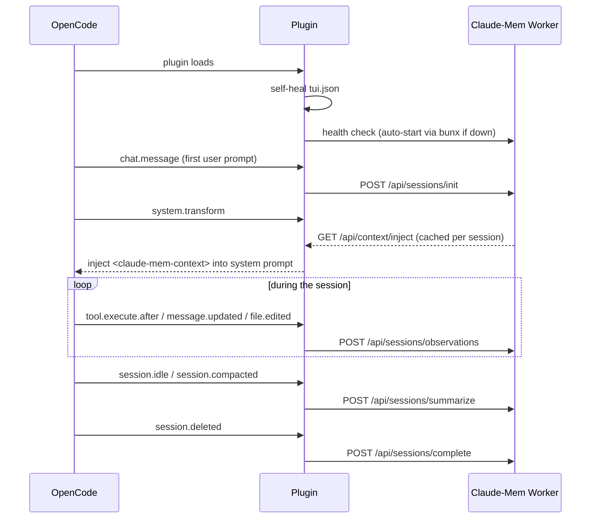

# opencode-claude-mem

Persistent memory for [OpenCode](https://opencode.ai), powered by
[Claude-Mem](https://github.com/thedotmack/claude-mem).

Share the same Claude-Mem worker, database, and memory across your coding
agents: memories written by Claude Code are visible to OpenCode, and vice
versa. Previous observations and summaries are injected into new OpenCode
sessions automatically.



> **Note:** This plugin is a thin OpenCode adapter for an existing Claude-Mem
> installation. It does **not** install Claude-Mem, manage slash commands, or
> register Claude Code MCP servers for you.

## Quick Start

1. Install and configure Claude-Mem in Claude Code.
2. Add this plugin to your `opencode.json`:

```json
{
  "plugin": ["@ephemushroom/opencode-claude-mem"]
}
```

3. Restart OpenCode.
4. Start a session — memory context is injected automatically, the `mem-*`
   tools become available, and a collapsible **Memory** section appears in the
   sidebar.

Using [oh-my-openagent](https://github.com/code-yeongyu/oh-my-openagent)?
See [Disable the Claude Code bridge](#using-with-oh-my-openagent-disable-the-claude-code-bridge)
to avoid running two claude-mem integrations at once.

## What You Get

| Surface | What it looks like |
|---|---|
| **System prompt** | `<claude-mem-context>` block with recent observations + session summaries for the current project |
| **Tools** | `mem-search` → `mem-timeline` → `mem-get-observations` (full search workflow, no MCP server needed) |
| **Sidebar** | `▶ Memory (online, 11.7k obs)` — click to expand recent sessions and latest observations |
| **Background** | Every tool call, assistant message, and file edit captured as observations; sessions summarized on idle |

### Sidebar

The plugin registers a sidebar section styled after OpenCode's native
MCP/Context sections — borderless, click-to-toggle:

```text
▶ Memory (online, 11.7k obs)          ← collapsed (default), single line
```

```text
▼ Memory                              ← click header to expand
  • obs 11.7k · sum 2311 · ses 1186
  Recent sessions
  • 实现 tui.json 自动注册（self-heal）机制…
  • 设计 Memory 面板：跨工具记忆共享…
  Latest
  ◆ Memory 侧边栏完整通过 CI 流水线…
  ● 修复点击不展开：改用 solid-js signal…
  ⚖ 计划按原生风格重构 Memory 面板…
```

- Summary line turns **yellow** while the worker is processing (`(queue N)`)
  and **red** when offline (`(offline)`).
- Observation icons match the injected context legend: ◆ feature · ● bugfix ·
  ⚖ decision · ○ discovery · ↻ refactor · ✓ change · ⚠/⚷ security.
- Recent items are only fetched while expanded, keeping the collapsed poll
  loop cheap (stats every 5s).
- Fails open: worker offline → shows the offline state, never blocks the TUI.

The sidebar loads via the package's `./tui` export. On startup the plugin
**self-heals `~/.config/opencode/tui.json`**: if it is registered as a server
plugin in `opencode.json` but missing from the TUI plugin list, it appends
itself — no manual configuration. Symlinked `tui.json` files are written
through, preserving dotfiles setups.

### Memory Tools

Three native OpenCode tools cover the same 3-step workflow as the upstream
Claude-Mem MCP server — no MCP server or stdio subprocess required:



| Tool | Worker endpoint | Use it for |
|---|---|---|
| `mem-search` | `GET /api/search` | Formatted index with query, project, source, type, date, pagination, and ordering filters |
| `mem-timeline` | `GET /api/timeline` | Chronological records around an `anchor` ID (or auto-located via `query`) |
| `mem-get-observations` | `POST /api/observations/batch` | Full details for IDs — e.g. the IDs shown in the injected context |

## How It Works



The plugin is intentionally small: it only adapts OpenCode hook events to the
Claude-Mem worker HTTP API. All indexing, summarization, memory search, and
storage stay in upstream Claude-Mem.

### Cross-Tool Memory Sharing

Writes are attributed (`platformSource: "opencode"`), reads are shared:

| Operation | Behavior |
|---|---|
| OpenCode writes | Stored as `platform_source=opencode` |
| Claude Code writes | Stored as `platform_source=claude` |
| Either reads (inject/search) | Sees **all** memory for the project, regardless of source |

The sharing key is the **project name** (worktree directory name) — work in
the same project directory and memory flows both ways.

## Installation

### Prerequisites

- [Claude Code](https://claude.com/claude-code) with
  [Claude-Mem](https://github.com/thedotmack/claude-mem) installed
- [OpenCode](https://opencode.ai) with plugin support
- A running Claude-Mem worker (default `127.0.0.1:37777`)

### Step 1: Install Claude-Mem

In Claude Code:

```text
/plugin marketplace add thedotmack/claude-mem
/plugin install claude-mem
```

Restart Claude Code so the worker can start and initialize its data directory.

### Step 2: Add the OpenCode Plugin

Add this plugin to your project or global `opencode.json`:

```json
{
  "plugin": ["@ephemushroom/opencode-claude-mem"]
}
```

Then restart OpenCode.

### Step 3: Verify

```bash
curl -s http://127.0.0.1:37777/api/health
```

If the worker is healthy, OpenCode shows a toast like
`Memory active · <project>` when a session starts, and the sidebar shows
`▶ Memory (online, … obs)`.

## Using with oh-my-openagent: Disable the Claude Code Bridge

oh-my-openagent ships a Claude Code compatibility layer that can load Claude
Code plugins — including `claude-mem@thedotmack` — inside OpenCode. Running
that bridge **and** this native plugin at the same time means two integrations
write to the same worker:

- duplicate observations for every tool call
- duplicate context injection and toasts
- bridged MCP tools (`search`, `timeline`, `get_observations`) shadowing the
  native `mem-*` tools

Disable the bridge for claude-mem in `~/.config/opencode/oh-my-openagent.jsonc`:

```jsonc
{
  "claude_code": {
    "plugins_override": {
      "claude-mem@thedotmack": false
    }
  }
}
```

This only disables the *bridged* claude-mem inside OpenCode. Claude Code
itself keeps using claude-mem normally, and memory stays shared through the
worker. Everything the bridge provided is covered natively by this plugin:

| Bridged (before) | Native (this plugin) |
|---|---|
| MCP `search` | `mem-search` tool |
| MCP `timeline` | `mem-timeline` tool |
| MCP `get_observations` | `mem-get-observations` tool |
| `SessionStart` context hook | `system.transform` injection |
| `PostToolUse` observation hook | `tool.execute.after` capture |

## Reference

### Hook Mapping

| Claude Code | OpenCode plugin | Purpose |
|---|---|---|
| `SessionStart` | `experimental.chat.system.transform` | Inject memory context |
| `SessionStart` | `experimental.session.compacting` | Preserve memory during compaction |
| `UserPromptSubmit` | `chat.message` | Initialize session with real user prompt |
| `PostToolUse` | `tool.execute.after` | Capture tool observations |
| Claude-Mem MCP `search` | `tool` (`mem-search`) | Search memory from OpenCode |
| Claude-Mem MCP `timeline` | `tool` (`mem-timeline`) | Chronological context around an observation |
| Claude-Mem MCP `get_observations` | `tool` (`mem-get-observations`) | Fetch full observation details by ID |
| _(streaming)_ | `event` (`message.updated`) | Capture assistant text (debounced 250ms) |
| _(streaming)_ | `event` (`file.edited`) | Record file edit observations |
| _(compaction)_ | `event` (`session.compacted`) | Summarize after OpenCode compacts |
| `Stop` | `event` (`session.idle`) | Flush + summarize |
| `SessionEnd` | `event` (`session.deleted`) | Flush + complete (no zombie active rows) |

### Worker API Endpoints Used

| Method | Endpoint | Purpose |
|---|---|---|
| `GET` | `/api/health` | Health check |
| `GET` | `/api/context/inject?project={name}` | Fetch formatted memory context |
| `POST` | `/api/sessions/init` | Initialize session |
| `POST` | `/api/sessions/observations` | Store tool observation |
| `POST` | `/api/sessions/summarize` | Trigger summarization |
| `POST` | `/api/sessions/complete` | Complete session |
| `GET` | `/api/search?query=...&project=...&dateStart=...&dateEnd=...` | `mem-search`; also supports `limit`, `platformSource`, `type`, `obs_type`, `offset`, and `orderBy` |
| `GET` | `/api/timeline?project={name}&anchor={id}` | `mem-timeline` |
| `POST` | `/api/observations/batch` | `mem-get-observations` |
| `GET` | `/api/stats` + `/api/processing-status` | Sidebar status |
| `GET` | `/api/summaries` + `/api/observations` | Sidebar recent items (expanded only) |

The worker endpoint is resolved in this order: `CLAUDE_MEM_WORKER_HOST` /
`CLAUDE_MEM_WORKER_PORT` environment variables → `~/.claude-mem/settings.json`
→ `127.0.0.1:37777`.

### Key Implementation Details

- **Thin client architecture** — `src/index.ts` handles OpenCode hooks and
  session state; `src/worker-client.ts` is a static HTTP client; `src/tui.ts`
  renders the sidebar; `src/tui-registration.ts` self-heals `tui.json`.
- **Zero runtime dependencies** — the OpenCode plugin SDK is bundled into
  `dist/`, keeping the install footprint under ~500 KB.
- **Reactive sidebar** — collapse state and view data are solid-js signals
  (shared with OpenCode's own solid instance via `--external solid-js`), so
  clicking the header re-renders reliably; falls back to plain closures if
  solid-js cannot be resolved.
- **No console logging** — `console.*` output corrupts the OpenCode TUI;
  the plugin never logs and never throws from hooks.
- **Deferred toast** — health toasts only happen after hook execution begins,
  avoiding startup crashes caused by early TUI access.
- **Auto-start** — if the worker is down on load, spawns
  `bunx claude-mem start` once per OpenCode process (skipped if `bun` is not
  on `PATH`).
- **Context caching** — memory context is fetched once per session and reused
  across prompt injection and compaction.
- **Circular memory protection** — injected context is wrapped in
  `<claude-mem-context>` tags, Claude-Mem search tools are skipped from
  observation capture, and memory tags are stripped before storage.
- **Observation hardening** — low-value meta tools skipped; oversized payloads
  truncated by UTF-8 byte size (24 KB cap).
- **Field name correctness** — worker payloads use `contentSessionId`, not
  `claudeSessionId` (the wrong name fails silently).
- **Session lifecycle hygiene** — `session.deleted` triggers
  `completeSession`, preventing zombie `active` rows from accumulating stale
  `pending_messages`.

## Troubleshooting

### No memory appears in OpenCode

- Confirm the worker is running:

```bash
curl -s http://127.0.0.1:37777/api/health
```

- Make sure Claude-Mem has already been installed and used from Claude Code.
- Start a fresh OpenCode session after the worker is healthy.

### OpenCode shows `Worker offline`

The plugin tries to launch the worker via `bunx claude-mem start` once on
plugin load. If the toast still appears:

- Confirm `bun` is on your `PATH` — `bun --version` should print a version.
- Confirm `claude-mem` is installed for `bunx` — run
  `bunx claude-mem --version` once to populate the cache.
- On Windows after a forced kill, port `37777` may stay in `TIME_WAIT` for
  30-120 seconds; wait it out or restart Claude Code.
- Restart Claude Code to bring Claude-Mem back up via its own supervisor.

### Sidebar Memory section is missing

- Check `~/.config/opencode/tui.json` contains this plugin in its `plugin`
  array — the plugin self-heals this file on load, so restarting OpenCode
  twice (once to heal, once to load) fixes a missing entry.
- The sidebar requires OpenCode's `@opentui/solid` runtime; if unavailable the
  section is skipped silently while hooks and tools keep working.

### Clicking the Memory header does nothing

- Upgrade to ≥ 0.4.2 — earlier versions used non-reactive state and the
  toggle never re-rendered.

### Duplicate observations / duplicate toasts

- You are likely running both this plugin and a Claude Code compatibility
  bridge for claude-mem. See
  [Disable the Claude Code bridge](#using-with-oh-my-openagent-disable-the-claude-code-bridge).

### Observations are missing or incomplete

- Low-value meta tools and Claude-Mem search tools are skipped by design.
- Very large tool outputs are truncated before storage (24 KB).

## Development

```bash
bun install
bun run build       # bundle dist/index.js + dist/tui.js + emit declarations
bun test            # bun's built-in runner
bun run lint        # oxlint
bun run fmt:check   # oxfmt
```

If you edit source code locally, rebuild and restart OpenCode to pick up the
new plugin bundle.

## License

MIT
