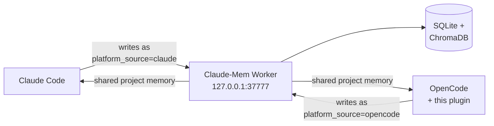
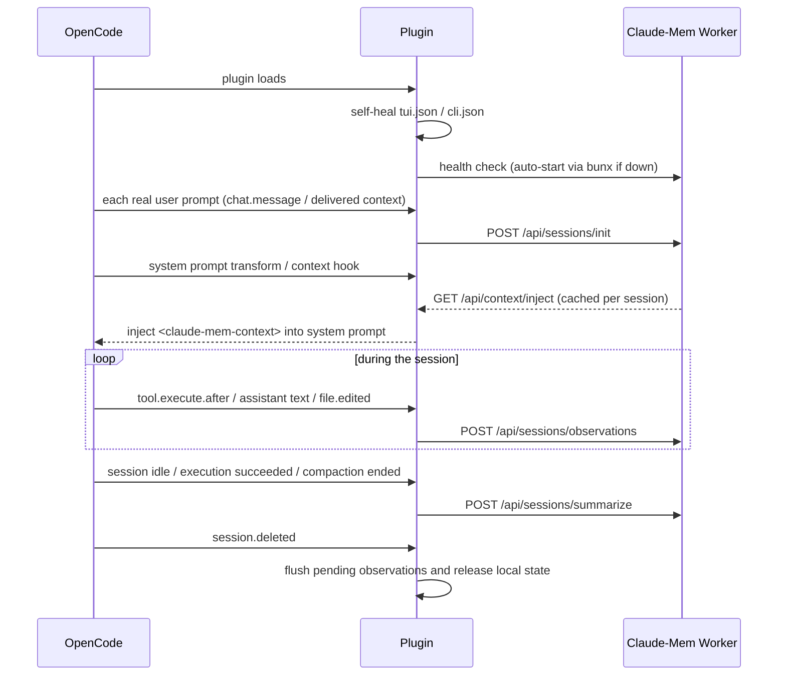

# opencode-claude-mem

Persistent memory for [OpenCode](https://opencode.ai), powered by
[Claude-Mem](https://github.com/thedotmack/claude-mem).

**Supports OpenCode 1 and OpenCode 2 with the same package name from v0.5.0.**
No `/v2` or `/cli` suffix is required. Existing version-specific entries remain compatible.

**v0.6.0** adds per-turn memory tracking, `mem-save`, file history and opt-in semantic
injection, and fixes the OpenCode 2 sidebar's `No renderer found` crash.

Share the same Claude-Mem worker, database, and memory across your coding
agents: memories written by Claude Code are visible to OpenCode, and vice
versa. Previous observations and summaries are injected into new OpenCode
sessions automatically.


```mermaid
flowchart LR
    CC[Claude Code] -->|writes as<br/>platform_source=claude| W
    OC[OpenCode<br/>+ this plugin] -->|writes as<br/>platform_source=opencode| W
    W[Claude-Mem Worker<br/>127.0.0.1:37777] --> DB[(SQLite +<br/>ChromaDB)]
    W -->|shared project memory| CC
    W -->|shared project memory| OC
```

> **Note:** This plugin is a thin OpenCode adapter for an existing Claude-Mem
> installation. It does **not** install Claude-Mem, manage slash commands, or
> register Claude Code MCP servers for you.

## Quick Start

1. Install and configure Claude-Mem in Claude Code.
2. Add this plugin to your `opencode.json` — pick the section matching your
   OpenCode version:

### OpenCode 1

```json
{
  "plugin": ["@ephemushroom/opencode-claude-mem"]
}
```

### OpenCode 2

```json
{
  "plugins": ["@ephemushroom/opencode-claude-mem"]
}
```

3. Restart OpenCode.
4. Start a session — memory context is injected automatically, the `mem-*`
   tools become available, and a collapsible **Memory** section appears in the
   sidebar (both versions).

Using [oh-my-openagent](https://github.com/code-yeongyu/oh-my-openagent)?
See [Disable the Claude Code bridge](#using-with-oh-my-openagent-disable-the-claude-code-bridge)
to avoid running two claude-mem integrations at once.

## OpenCode 1 and 2

OpenCode 1 and OpenCode 2 install side by side (`opencode` vs `opencode2`) and
their plugin APIs are incompatible. This package exposes **one bare package
name for both runtimes**, with thin bridges that select the existing adapter
contract. No `/v2` or `/cli` suffix is needed:

| | OpenCode 1 | OpenCode 2 |
|---|---|---|
| **Binary** | `opencode` | `opencode2` |
| **Server plugin config** | `opencode.json` → `plugin` | `opencode.json` → `plugins` |
| **Server plugin entry** | `@ephemushroom/opencode-claude-mem` | `@ephemushroom/opencode-claude-mem` |
| **Sidebar config** | `~/.config/opencode/tui.json` → `plugin` (self-healed) | `~/.config/opencode/cli.json` → `plugins` (self-healed) |
| **Sidebar config entry** | `@ephemushroom/opencode-claude-mem` | `@ephemushroom/opencode-claude-mem` |
| **Sidebar resolution** | package `./tui` export, `tui()` | package `./tui` export, `setup()` |

Both adapters talk to the same Claude-Mem worker, so memory written from V1,
V2, and Claude Code is shared. The V2 entrypoint covers the same behavior —
context injection, tool observation capture, the `mem-search`/`mem-timeline`/
`mem-get-observations`/`mem-save` tools, per-user-message registration and session summarize/cleanup via the event
stream.

The bare package is tested with `opencode 1.18.29` and
`opencode2 0.0.0-beta-19151`; v0.6.0 also passes server and real
sidebar interaction checks on `0.0.0-beta-19192`. The V2 SDK is pinned because preview APIs can
change. Unified routing requires **v0.5.0 or later**; the older `0.4.4` package
does not provide it. Upgrade the package in both server and sidebar configurations.
Existing `/server`, `/tui`, `/v2`, and `/cli` exports remain supported; replace
an old config entry rather than adding the bare name beside it.

After upgrading, finish active tasks, close the client, and restart the V2
background service with `opencode2 service restart` before reopening `opencode2`.
For V1, restart `opencode`. Verify server activation with `opencode2 plugin list`.

In V2, installing the server plugin
(`"plugins": ["@ephemushroom/opencode-claude-mem"]`) auto-appends the same
bare package to `~/.config/opencode/cli.json` on first load. Restart OpenCode
after that first load if the sidebar is not yet present. Beta `19151` still
uses a separate CLI config; this is not a promise of same-launch discovery
from the server config alone. To register manually, use:

```json
{
  "plugins": ["@ephemushroom/opencode-claude-mem"]
}
```

## What You Get

| Surface | What it looks like |
|---|---|
| **System prompt** | `<claude-mem-context>` block with recent observations + session summaries for the current project |
| **Tools** | `mem-search` → `mem-timeline` → `mem-get-observations`, plus explicit `mem-save` (no MCP server needed) |
| **Read history** | Bounded supplementary file history after eligible file reads; original file output is preserved |
| **Optional semantic context** | Relevant project memories for the current real user prompt; **off by default** |
| **Sidebar** | `▶ Memory (online, 11.7k obs)` — click to expand recent sessions and latest observations |
| **Background** | Every tool call, assistant message, and file edit captured as observations; sessions summarized on idle |

### Sidebar

The plugin registers a sidebar section styled after OpenCode's native
MCP/Context sections — borderless, click-to-toggle:

```text
▶ Memory (online, 11.7k obs)          ← collapsed (default), single line
```

```text
▼ Memory                              ← click header to expand
  • obs 11.7k · sum 2311 · ses 1186
  Recent sessions
  • 实现 tui.json 自动注册（self-heal）机制…
  • 设计 Memory 面板：跨工具记忆共享…
  Latest
  ◆ Memory 侧边栏完整通过 CI 流水线…
  ● 修复点击不展开：改用 solid-js signal…
  ⚖ 计划按原生风格重构 Memory 面板…
```

- Summary line turns **yellow** while the worker is processing (`(queue N)`)
  and **red** when offline (`(offline)`).
- Observation icons match the injected context legend: ◆ feature · ● bugfix ·
  ⚖ decision · ○ discovery · ↻ refactor · ✓ change · ⚠/⚷ security.
- Recent items are only fetched while expanded, keeping the collapsed poll
  loop cheap (stats every 5s).
- Fails open: worker offline → shows the offline state, never blocks the TUI.

The sidebar loads via the package's `./tui` bridge in both versions (OpenCode 2
registers the bare name in `~/.config/opencode/cli.json`). On startup
the plugin **self-heals the TUI config**: if it is registered as a server
plugin but missing from the TUI plugin list, it appends itself — no manual
configuration. OpenCode 1 writes into `tui.json` (symlinked files are written
through, preserving dotfiles setups); OpenCode 2 appends
`@ephemushroom/opencode-claude-mem` to `cli.json`'s `plugins` array.
Existing bare, `/cli`, or `/tui` sidebar entries (including versions and
object-form options) are left untouched, without adding another entry.
Malformed or comment-bearing CLI config is left untouched; add the bare name
manually in that case.

### Memory Tools

Three native OpenCode tools cover the same 3-step search workflow as the upstream
Claude-Mem MCP server — no MCP server or stdio subprocess required:


```mermaid
flowchart LR
    A["mem-search<br/><i>find IDs by query</i>"] --> B["mem-timeline<br/><i>context around an ID</i>"]
    B --> C["mem-get-observations<br/><i>full details for IDs</i>"]
```

| Tool | Worker endpoint | Use it for |
|---|---|---|
| `mem-search` | `GET /api/search` | Formatted index with query, project, source, type, date, pagination, and ordering filters |
| `mem-timeline` | `GET /api/timeline` | Chronological records around an `anchor` ID (or auto-located via `query`) |
| `mem-get-observations` | `POST /api/observations/batch` | Full details for IDs — e.g. the IDs shown in the injected context |
| `mem-save` | `POST /api/memory/save` | Explicitly save required `text`, optional `title` and `project` (defaults to current project) |

`mem-save` strips `<private>` and `<claude-mem-context>` material from text/title,
rejects empty/fully stripped content and values above 24 KiB, and reports success
only for a valid Worker acknowledgement. It never retries automatically: after
a timeout, check with search before retrying because the write may have succeeded.
Manual saves do not require an observation-model inference pass, but the Worker
still performs asynchronous vector indexing; this is **not** a promise of zero
embedding cost. Native and namespaced `mem-save` calls are excluded from automatic
observation capture.

### Memory configuration (both runtimes)

The per-turn registration, `mem-save`, file history, and semantic options described
here require **v0.6.0 or later**. Upgrade both server and sidebar package entries;
`0.5.0` does not include these features or the renderer fix.

Configuration is read once when the server plugin is set up. Quit and restart
OpenCode after changing options, environment, or settings; on V2 also restart the
background service. No semantic feature is enabled globally by this plugin.

**OpenCode 1** uses a tuple in `opencode.json`:

```json
{
  "plugin": [["@ephemushroom/opencode-claude-mem", {
    "semanticInjection": { "enabled": true, "limit": 5, "maxChars": 6000, "timeoutMs": 2000 },
    "fileContext": { "enabled": true, "limit": 15, "maxChars": 6000, "timeoutMs": 1500 }
  }]]
}
```

**OpenCode 2** uses a package/options object (not a V1 tuple):

```json
{
  "plugins": [{
    "package": "@ephemushroom/opencode-claude-mem",
    "options": {
      "semanticInjection": { "enabled": true, "limit": 5, "maxChars": 6000, "timeoutMs": 2000 },
      "fileContext": { "enabled": true, "limit": 15, "maxChars": 6000, "timeoutMs": 1500 }
    }
  }]
}
```

| Option | Semantic default | File-history default | Accepted values |
|---|---|---|---|
| `enabled` | `false` | `true` | Boolean |
| `limit` | `5` | `15` | Integer 1–50 |
| `maxChars` | `6000` | `6000` | Integer 256–24000; supplementary payload only |
| `timeoutMs` | `2000` | `1500` | Integer 100–10000 |

Per-field precedence for semantic `enabled` and `limit` is **explicit plugin
options > environment > `~/.claude-mem/settings.json` > defaults**. The environment
and settings keys are `CLAUDE_MEM_SEMANTIC_INJECT` (`true`/`false` or `1`/`0`) and
`CLAUDE_MEM_SEMANTIC_INJECT_LIMIT` (integer 1–50). Settings may use booleans/numbers
or their string equivalents. Explicit `false` overrides environment `true`.
Invalid values fall through to the next valid source; other controls use explicit
options then defaults. Settings are read-only and never logged.

Semantic retrieval uses `POST /api/context/semantic` with `{q, project, limit}`
and reads JSON `{context, count}`. `q` is the sanitized real current prompt,
at least 20 characters; media-only, fully private, and identifiable internal
messages are excluded. No `platformSource` filter is sent, so Claude Code and
OpenCode memories remain shared. Each real prompt identity gets at most one
retrieval attempt, including failure/timeout, reused across tool-loop dispatches.
The system block is replaced rather than accumulated. Old Workers, malformed
responses and offline retrieval fail open.

File history uses `GET /api/observations/by-file` with repeated `path` parameters
(absolute and project-relative, normalized to forward slashes), `projects` and `limit`. Supported read arguments
include V1 `filePath`, V2 `path`, and `file_path`/`filePaths`/`file_paths` aliases.
Only existing regular files of at least 1500 bytes qualify, at most 10 paths per
read. Lookups run concurrently within one configured per-read deadline (including
file metadata lookup), not ten serial timeout periods. Rows are deduplicated by
memory session and the displayed text is bounded; a file whose mtime is at least
the newest observation timestamp gets no history. Delivered history is deduplicated per
session/file revision (mtime and size); failures and timeouts may retry on a later read.
Editing the file or starting a new session also permits another lookup. Supplementary history is explicitly
labeled and wrapped in memory tags, appended without replacing/truncating the
original read result, and never included in the automatic tool observation.
Known child sessions (`parentID` when supplied by the host) skip file-history
enrichment; V1 resumed sessions without that metadata cannot reliably be identified
as subagents and are not guessed from the agent's name.

### Prompt lifecycle and Worker limitations

V1 registers stable `chat.message` IDs; V2 records admission IDs without writing,
then registers only IDs present in delivered `session.context` records at model
dispatch. Thus queued V2 prompts do not advance the Worker's current prompt.
Resumed sessions without local admission history use the latest delivered real
user turn, not a synthetic `SESSION_START`, and tool callbacks do not reread the
whole history. Registrations are serialized per session and successful IDs are
deduplicated locally; a failed registration retains its real prompt for retry.
Media-only turns use `[media prompt]`. Fully private or identifiable synthetic
turns suppress automatic observations, summaries and semantic retrieval locally,
including when the Worker reports a skipped/private registration.

**Upstream v13.24.1 still deduplicates identical prompt text within its own time
window and has no consumed external prompt-ID contract.** This plugin submits
distinct IDs even if their text is identical, without prefixing/changing the text,
but cannot guarantee distinct database prompt rows. A `duplicate` acknowledgement
is accepted; other skipped registrations do not authorize automatic capture.
V1 exposes submission callbacks rather than V2's delivered/inbox distinction;
it cannot provide the same queued-consumption guarantee. A restart cannot restore
the plugin's in-memory ID dedupe ledger, so upstream dedupe remains relevant.

Base context is session-isolated, limited to 24000 characters, with a two-second
request timeout. It is refreshed at V1 compaction start/end and V2 compaction
requests/completed events or changed compaction records. Failed reads are retryable;
an invalidated or deleted session cannot be repopulated by an older in-flight read.

## How It Works


```mermaid
sequenceDiagram
    participant OC as OpenCode
    participant P as Plugin
    participant W as Claude-Mem Worker

    OC->>P: plugin loads
    P->>P: self-heal tui.json / cli.json
    P->>W: health check (auto-start via bunx if down)
    OC->>P: each real user prompt (chat.message / delivered context)
    P->>W: POST /api/sessions/init
    OC->>P: system prompt transform / context hook
    W-->>P: GET /api/context/inject (cached per session)
    P-->>OC: inject <claude-mem-context> into system prompt
    loop during the session
        OC->>P: tool.execute.after / assistant text / file.edited
        P->>W: POST /api/sessions/observations
    end
    OC->>P: session idle / execution succeeded / compaction ended
    P->>W: POST /api/sessions/summarize
    OC->>P: session.deleted
    P->>P: flush pending observations and release local state
```

The plugin is intentionally small: it only adapts OpenCode hook events to the
Claude-Mem worker HTTP API. All indexing, summarization, memory search, and
storage stay in upstream Claude-Mem.

### Hook Mapping (V1 ↔ V2)

The V1 and V2 entrypoints adapt the same behavior onto two different plugin
APIs:

| Behavior | OpenCode 1 | OpenCode 2 |
|---|---|---|
| Inject memory context | `experimental.chat.system.transform` | `ctx.session.hook('context')` |
| Refresh memory on compaction | `experimental.session.compacting` + `session.compacted` | compaction model requests/events + delivered compaction records |
| Register each real user prompt | `chat.message` (message ID) | `ctx.session.hook('context')` (`ctx.session.context` delivered IDs; not inbox admission) |
| Capture tool observations | `tool.execute.after` | `ctx.tool.hook('execute.after')` |
| Custom memory tools | `tool` (`mem-search`, …) | `ctx.tool.transform` (`tools.add`) |
| Assistant text capture | `event` (`message.updated`, debounced 250ms) | `session.text.ended` event (complete text) |
| File edit observations | `event` (`file.edited`) | `ctx.tool.hook('execute.after')` |
| Summarize on idle | `event` (`session.idle`) | `session.execution.succeeded` event |
| Summarize after compaction | `event` (`session.compacted`) | `session.compaction.ended` event |
| Release session tracking | `event` (`session.deleted`) | `session.deleted` event |
| Sidebar slot | `api.slots.register` (`sidebar_content`) | `ctx.ui.slot({ append: 'sidebar.content', render })` |

### Cross-Tool Memory Sharing

Writes are attributed (`platformSource: "opencode"`), reads are shared:

| Operation | Behavior |
|---|---|
| OpenCode writes | Stored as `platform_source=opencode` |
| Claude Code writes | Stored as `platform_source=claude` |
| Either reads (inject/search) | Sees **all** memory for the project, regardless of source |

The sharing key is the **project name** (worktree directory name) — work in
the same project directory and memory flows both ways.

## Installation

### Prerequisites

- [Claude Code](https://claude.com/claude-code) with
  [Claude-Mem](https://github.com/thedotmack/claude-mem) installed
- [OpenCode](https://opencode.ai) with plugin support
- A running Claude-Mem worker (default `127.0.0.1:37777`)

### Step 1: Install Claude-Mem

In Claude Code:

```text
/plugin marketplace add thedotmack/claude-mem
/plugin install claude-mem
```

Restart Claude Code so the worker can start and initialize its data directory.

### Step 2: Add the OpenCode Plugin

Add this plugin to your project or global `opencode.json`:

**OpenCode 1** (`opencode`):

```json
{
  "plugin": ["@ephemushroom/opencode-claude-mem"]
}
```

**OpenCode 2** (`opencode2`):

```json
{
  "plugins": ["@ephemushroom/opencode-claude-mem"]
}
```

The two runtimes can be installed side by side and use the same package name.
Their config keys remain different: `plugin` in V1, `plugins` in V2.

Then restart OpenCode.

### Step 3: Verify

```bash
curl -s http://127.0.0.1:37777/api/health
```

If the worker is healthy, the sidebar shows `▶ Memory (online, … obs)`.
OpenCode 1 also shows a `Memory active · <project>` toast when a session
starts (OpenCode 2 only toasts a warning when the worker is offline).

## Using with oh-my-openagent: Disable the Claude Code Bridge

oh-my-openagent ships a Claude Code compatibility layer that can load Claude
Code plugins — including `claude-mem@thedotmack` — inside OpenCode. Running
that bridge **and** this native plugin at the same time means two integrations
write to the same worker:

- duplicate observations for every tool call
- duplicate context injection and toasts
- bridged MCP tools (`search`, `timeline`, `get_observations`) shadowing the
  native `mem-*` tools

Disable the bridge for claude-mem in `~/.config/opencode/oh-my-openagent.jsonc`:

```jsonc
{
  "claude_code": {
    "plugins_override": {
      "claude-mem@thedotmack": false
    }
  }
}
```

This only disables the *bridged* claude-mem inside OpenCode. Claude Code
itself keeps using claude-mem normally, and memory stays shared through the
worker. Everything the bridge provided is covered natively by this plugin:

| Bridged (before) | Native (this plugin) |
|---|---|
| MCP `search` | `mem-search` tool |
| MCP `timeline` | `mem-timeline` tool |
| MCP `get_observations` | `mem-get-observations` tool |
| `SessionStart` context hook | `system.transform` injection |
| `PostToolUse` observation hook | `tool.execute.after` capture |

## Reference

### Hook Mapping

Claude Code hooks → this plugin's adapters (see [Hook Mapping (V1 ↔ V2)](#hook-mapping-v1--v2)
for the per-runtime API):

| Claude Code | OpenCode (both runtimes) | Purpose |
|---|---|---|
| `SessionStart` | system prompt injection (`system.transform` / `context` hook) | Inject memory context |
| `SessionStart` | compaction injection (`session.compacting` / context hook) | Preserve memory during compaction |
| `UserPromptSubmit` | session init (`chat.message` / context hook) | Initialize session with real user prompt |
| `PostToolUse` | observation capture (`tool.execute.after` / `execute.after` hook) | Capture tool observations |
| Claude-Mem MCP `search` | `mem-search` tool | Search memory from OpenCode |
| Claude-Mem MCP `timeline` | `mem-timeline` tool | Chronological context around an observation |
| Claude-Mem MCP `get_observations` | `mem-get-observations` tool | Fetch full observation details by ID |
| _(streaming)_ | assistant text (`message.updated` / `session.text.ended`) | Capture assistant text |
| _(streaming)_ | file edits (`file.edited` / tool hook) | Record file edit observations |
| _(compaction)_ | `session.compacted` / `session.compaction.ended` | Summarize after OpenCode compacts |
| `Stop` | `session.idle` / `session.execution.succeeded` | Flush + summarize |
| `SessionEnd` | `session.deleted` | Flush observations and release local state; Worker self-completes |

### Worker API Endpoints Used

| Method | Endpoint | Purpose |
|---|---|---|
| `GET` | `/api/health` | Health check |
| `GET` | `/api/context/inject?project={name}` | Fetch formatted memory context |
| `POST` | `/api/sessions/init` | Initialize session |
| `POST` | `/api/sessions/observations` | Store tool observation |
| `POST` | `/api/sessions/summarize` | Trigger summarization |
| `GET` | `/api/search?query=...&project=...&dateStart=...&dateEnd=...` | `mem-search`; also supports `limit`, `platformSource`, `type`, `obs_type`, `offset`, and `orderBy` |
| `GET` | `/api/timeline?project={name}&anchor={id}` | `mem-timeline` |
| `POST` | `/api/observations/batch` | `mem-get-observations` |
| `POST` | `/api/memory/save` | Explicit `mem-save`, nested `metadata.platformSource` attribution |
| `POST` | `/api/context/semantic` | Opt-in semantic context; JSON `{context,count}` response |
| `GET` | `/api/observations/by-file?path=...&path=...&projects=...&limit=...` | Supplementary file history |
| `GET` | `/api/stats` + `/api/processing-status` | Sidebar status |
| `GET` | `/api/summaries` + `/api/observations` | Sidebar recent items (expanded only) |

The worker endpoint is resolved in this order: `CLAUDE_MEM_WORKER_HOST` /
`CLAUDE_MEM_WORKER_PORT` environment variables → `~/.claude-mem/settings.json`
→ `127.0.0.1:37777`.

### Key Implementation Details

- **Dual-runtime architecture** — `src/index.ts` is the OpenCode 1 plugin,
  `src/v2.ts` the OpenCode 2 plugin (`Plugin.define`), `src/tui.ts` the V1
  sidebar, `src/cli.ts` the V2 sidebar; `src/shared.ts` and
  `src/sidebar-model.ts` hold the shared pure helpers; `src/worker-client.ts`
  is a static HTTP client; `src/tui-registration.ts` self-heals `tui.json`
  (V1) and `cli.json` (V2).
- **Static package bridges** — `src/package-server.ts` exposes `{ id, server,
  setup }` at both `.` and `./server`; `src/package-tui.ts` exposes `{ id, tui,
  setup }` at `./tui`. V1 reads `server`/`tui`; V2 reads `setup`. Neither bridge
  invokes both adapters. Both installed server loaders prefer `./server`, so
  routing only the root export to V2 is insufficient. Never combine `server`
  and `tui` in one object: V1 rejects that shape.
- **Host renderer ownership** — the built TUI bridge uses explicit `.js`
  relative imports so the host discovers both adapter modules and routes their
  OpenTUI/Solid imports to its own runtime. Extensionless bridge imports can bypass
  that prescan and crash the sidebar with `No renderer found`.
- **Zero runtime dependencies for server plugins** — the OpenCode plugin SDK
  is bundled into `dist/` (V1 `index.js` ~490 KB, V2 `v2.js` ~160 KB including
  bounded-response validation, using a deep SDK import that skips effect). The TUI entrypoints keep
  `@opentui/solid` external (provided by the host TUI).
- **Reactive sidebar** — collapse state and view data are solid-js signals
  (shared with OpenCode's own solid instance via `--external solid-js`), so
  clicking the header re-renders reliably; falls back to plain closures if
  solid-js cannot be resolved.
- **No console logging** — `console.*` output corrupts the OpenCode TUI;
  the plugin never logs and never throws from hooks.
- **Deferred toast** — health toasts only happen after hook execution begins,
  avoiding startup crashes caused by early TUI access.
- **Auto-start** — if the worker is down on load, spawns
  `bunx claude-mem start` once per OpenCode process (skipped if `bun` is not
  on `PATH`). Health is rechecked on subsequent hooks, so a recovered Worker
  does not require restarting OpenCode.
- **Context caching** — base memory context is reused per session until a
  compaction boundary invalidates it. Failed fetches are not cached.
- **Circular memory protection** — injected context is wrapped in
  `<claude-mem-context>` tags, Claude-Mem search tools are skipped from
  observation capture, and memory tags are stripped before storage.
- **Observation hardening** — low-value meta tools skipped; oversized payloads
  truncated by UTF-8 byte size (24 KB cap).
- **Field name correctness** — worker payloads use `contentSessionId`, not
  `claudeSessionId` (the wrong name fails silently).
- **Session lifecycle hygiene** — `session.deleted` flushes pending observations
  and releases local tracking. Claude-Mem self-completes processing; the removed
  `/api/sessions/complete` endpoint is not called.
- **Attribution** — observations include the OpenCode call ID as `tool_use_id`;
  summaries include the latest assistant's `observedModel` when available.
- **Write status** — failed HTTP writes return failure without throwing; a summary
  toast is shown only after the Worker accepts the request, not after generation.

## Troubleshooting

### No memory appears in OpenCode

- Confirm the worker is running:

```bash
curl -s http://127.0.0.1:37777/api/health
```

- Make sure Claude-Mem has already been installed and used from Claude Code.
- Start a fresh OpenCode session after the worker is healthy.

### OpenCode shows `Worker offline`

The plugin tries to launch the worker via `bunx claude-mem start` once on
plugin load. If the toast still appears:

- Confirm `bun` is on your `PATH` — `bun --version` should print a version.
- Confirm `claude-mem` is installed for `bunx` — run
  `bunx claude-mem --version` once to populate the cache.
- On Windows after a forced kill, port `37777` may stay in `TIME_WAIT` for
  30-120 seconds; wait it out or restart Claude Code.
- Restart Claude Code to bring Claude-Mem back up via its own supervisor.

### Sidebar Memory section is missing

- **OpenCode 1**: check `~/.config/opencode/tui.json` contains this plugin in
  its `plugin` array — the plugin self-heals this file on load, so restarting
  OpenCode twice (once to heal, once to load) fixes a missing entry.
- **OpenCode 2**: check `~/.config/opencode/cli.json` contains
  `@ephemushroom/opencode-claude-mem` in its `plugins` array — self-healed
  the same way (comment-bearing cli.json files are left untouched, so remove
  the comments or add the entry manually).
- The sidebar requires OpenCode's `@opentui/solid` runtime; if unavailable the
  section is skipped silently while hooks and tools keep working.

### Clicking the Memory header does nothing

- Upgrade to ≥ 0.4.2 — earlier versions used non-reactive state and the
  toggle never re-rendered.

### Duplicate observations / duplicate toasts

- You are likely running both this plugin and a Claude Code compatibility
  bridge for claude-mem. See
  [Disable the Claude Code bridge](#using-with-oh-my-openagent-disable-the-claude-code-bridge).

### Observations are missing or incomplete

- Low-value meta tools and Claude-Mem search tools are skipped by design.
- Very large tool outputs are truncated before storage (24 KB).

## Development

```bash
bun install
bun run build       # four adapters + package-server/package-tui bridges + declarations
bun test            # build first: export tests import the actual dist artifacts
bun run lint        # oxlint
bun run fmt:check   # oxfmt
bun src/test-fixtures/v2-runtime.ts    # installed V2: packed bare package, local model + Worker
bun src/test-fixtures/v2-runtime.ts v1 # installed V1: same package and behavior assertions
bun src/test-fixtures/tui-runtime.ts  # installed V2: real PTY session, render and mouse toggle
bun src/test-fixtures/tui-runtime.ts offline # offline sidebar still renders and toggles
bun --conditions=browser src/test-fixtures/cli-driver.ts render # real rendering + mouse click
```

If you edit source code locally, rebuild and restart OpenCode to pick up the
new plugin bundle.

The runtime QA drivers never write to your real config or memory database and
never use paid models. They pack the current build, serve it through a temporary
local registry, and ask the installed host to resolve the bare npm name in an
isolated home/cache. Registry access is needed for package dependencies. Server
QA drives base/opt-in semantic injection, exactly-once tool capture, all four memory tools,
private-save rejection, file-history enrichment without capture pollution, and
summarization. HTTP regression fixtures also cover repeated/distinct IDs, queued
V2 admission versus consumption, private turns, retries and compaction invalidation.
The V2 TUI probe uses ConPTY and xterm terminal cells to open a real session and
capture collapsed, expanded, and re-collapsed states with actual mouse events.
It checks online/offline operation, unchanged CLI config, and zero model requests.
Set `MEM_TUI_EVIDENCE_DIR` to retain text and truecolor ANSI captures. The separate
OpenTUI driver covers component behavior. V1's interactive host remains outside
this check; its server runtime is verified. Browser PNG fidelity is not claimed.

## License

MIT
